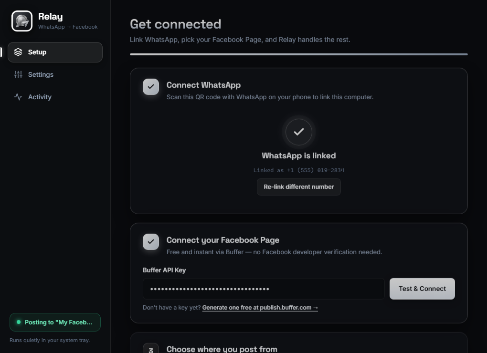
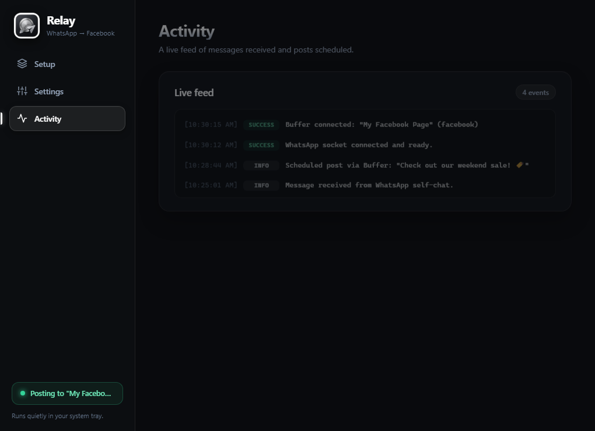
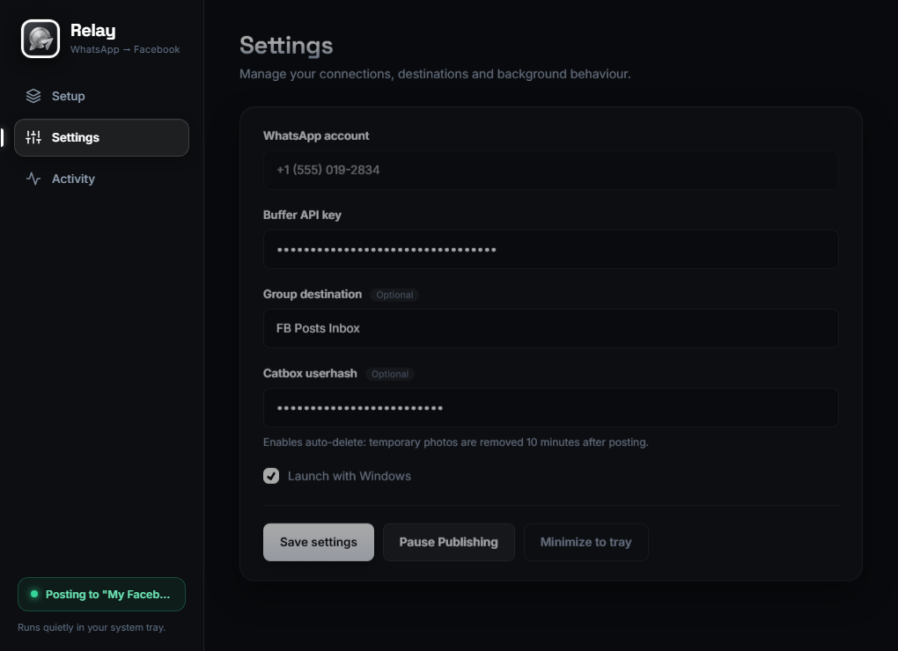

<p align="center">
  
</p>

<h1 align="center">Relay</h1>

<p align="center">
  <strong>Publish from WhatsApp to Facebook Pages instantly — from your self-chat or group.</strong>
</p>

<p align="center">
  <a href="#features">Features</a> •
  <a href="#screenshots">Screenshots</a> •
  <a href="#quick-start">Quick Start</a> •
  <a href="#whatsapp-commands">Commands</a> •
  <a href="#development--build">Developer Guide</a> •
  <a href="#architecture">Architecture</a>
</p>

<p align="center">
  
  
  
  
</p>

---

## Overview

**Relay** bridges your everyday WhatsApp messaging with your Facebook Page publishing workflow. Send a message, note, link, or photo directly inside your own WhatsApp **"Message Yourself"** self-chat (or a dedicated team group), and Relay automatically formats, hosts media, and publishes it to your Facebook Page.

- **Zero Meta App Approval**: Uses Buffer's official modern GraphQL API — no Facebook Developer account verification, no review submission, and no token expiration headaches.
- **Photos & Media Forwarding**: Uploads images to temporary storage and automatically cleans them up using Catbox auto-delete 10 minutes after posting.
- **Background System Tray**: Runs as an ultra-lightweight desktop app (~15MB RAM) that tucks into your system tray and starts on Windows boot.

---

## Screenshots

<p align="center">
  <em>Sleek, minimalist dark titanium interface with setup wizard, live feed, and tray controls.</em>
</p>

### 1. Connection & Setup Wizard
*Link WhatsApp with a simple QR scan, connect Buffer with one click, and choose posting destinations.*


### 2. Live Activity Feed
*Real-time log of every incoming WhatsApp message, scheduled post, and photo cleanup event.*


### 3. Settings & Controls
*Configure group filters, API keys, auto-delete userhash, or pause publishing anytime.*


---

## Features

- ⚡ **Instant or Scheduled Publishing**:
  - Plain messages post directly or with a 5-minute safety buffer.
  - `#at 18:00` or `#tomorrow 10:00` commands let you schedule posts right from chat.
- 📸 **Photo & Media Support**:
  - Send single photos with captions directly from WhatsApp.
  - Ephemeral media hosting via [Catbox](https://catbox.moe) with **automatic deletion** after Facebook ingests the image.
- 💬 **Multiple Chat Routing Modes**:
  - **Self-Chat Mode**: Watch your private "Message Yourself" conversation.
  - **Group Mode**: Dedicate a WhatsApp group (e.g. *"FB Posts Inbox"*) for team or personal drafting.
  - **Member Permissions**: Toggle whether any group participant or only your account can publish.
- 🔒 **Local & Private**:
  - All WhatsApp credentials and tokens stay 100% on your local machine (`auth_info_baileys/`).
  - No remote server or third-party cloud proxy inspects your personal chats.
- 🪟 **Desktop Tray Daemon**:
  - Built with **Tauri v2** and vanilla web technologies.
  - Native Windows tray integration: minimize, pause publishing, view status, and launch at startup.

---

## Two Publishing Modes

| Feature | Buffer Mode ⭐ *(Recommended)* | Meta Graph API *(Direct)* |
|---|---|---|
| **Meta App Review required?** | ❌ None | ✅ Yes (unless testing own page) |
| **Setup Time** | ~2 minutes | ~15–30 minutes |
| **API Key / Token Life** | Permanent until revoked | Short-lived (needs exchange dance) |
| **Free Tier** | Free (up to 3,000 req/mo & 10 queued posts) | Free |
| **Scheduling Support** | Built-in native queue | Relies on Graph schedule param |

---

## Quick Start

### Option A: Using the Desktop Application (Recommended)

1. **Launch Relay**: Run `app.exe` or start via `npm run tauri:dev`.
2. **Step 1 — Connect WhatsApp**: Scan the on-screen QR code from WhatsApp on your phone (**Settings → Linked Devices → Link a Device**).
3. **Step 2 — Connect Facebook via Buffer**:
   - Create a free account at [buffer.com](https://buffer.com) and link your Facebook Page.
   - Go to [publish.buffer.com](https://publish.buffer.com) → **Settings → API** and generate a free API key.
   - Paste the key into Relay and click **Test & Connect**.
4. **Step 3 — Pick Chat Destination**:
   - Select **Message Yourself** (default) or enter a **WhatsApp group name**.
5. **Step 4 — Save & Minimize**: Relay will sit quietly in your Windows system tray ready to publish.

---

### Option B: Running Headless / CLI Server

If running on a VPS or headless server:

1. **Clone & install**:
   ```bash
   git clone https://github.com/YarooqH/whatsapp-fb-publisher.git
   cd whatsapp-fb-publisher
   npm install
   ```

2. **Configure `.env`**:
   ```bash
   cp .env.example .env
   ```
   Edit `.env`:
   ```env
   WHATSAPP_SELF_JID=1234567890@s.whatsapp.net
   POSTING_PROVIDER=buffer
   BUFFER_API_KEY=your_buffer_api_key_here
   CATBOX_USERHASH=your_catbox_hash_optional
   ```

3. **Start the service**:
   ```bash
   npm start
   ```
   Scan the terminal QR code using WhatsApp on your phone.

---

## WhatsApp Commands

Send these commands inside your WhatsApp self-chat or designated publishing group:

| Command | Description | Example |
|---|---|---|
| `Hello World!` | Publishes text directly to your Facebook Page (5-min safety window) | `Check out our weekend sale! 🏷️` |
| `[Photo + Caption]` | Uploads photo, publishes with caption, auto-deletes temp file | *(Attach image in WhatsApp)* |
| `#at <time> <text>` | Schedules post for a specific time today (rolls over to tomorrow if past) | `#at 17:30 New video dropping tonight!` |
| `#profiles` | Lists your linked Facebook Pages and Buffer channel IDs | `#profiles` |
| `#group <name>` | Searches groups by name and returns matching IDs | `#group Marketing` |
| `#groupid` | Replies with the current group's unique JID (use inside any group) | `#groupid` |
| `#draft <text>` | Saves note locally in `drafts.json` without publishing | `#draft Content idea for next week` |
| `#ping` | Health-check responding with uptime and connection status | `#ping` |
| `#help` | Displays available commands and instructions | `#help` |

---

## Architecture

```
┌─────────────────────────────────────────────────────────────┐
│                      WhatsApp Client                        │
│             (Self-Chat or Dedicated Group Chat)             │
└──────────────────────────────┬──────────────────────────────┘
                               │  WebSocket (@whiskeysockets/baileys)
                               ▼
┌─────────────────────────────────────────────────────────────┐
│                        Relay Core                           │
│  - Message Parser & Command Router (#at, #draft, #profiles) │
│  - Media Extractor & Catbox Temporary Host                  │
│  - Local Store & Trajectory Logger                          │
└──────────────┬──────────────────────────────┬───────────────┘
               │                              │
     (Buffer Mode: Recommended)     (Direct Graph API Mode)
               ▼                              ▼
┌──────────────────────────────┐ ┌────────────────────────────┐
│      Buffer GraphQL API      │ │    Meta Facebook Graph     │
│   (Scheduled / Queue Post)   │ │      (Pages Endpoints)     │
└──────────────┬───────────────┘ └────────────┬───────────────┘
               │                              │
               └───────────────┬──────────────┘
                               ▼
               ┌──────────────────────────────┐
               │    Facebook Page Timeline    │
               └──────────────────────────────┘
```

---

## Development & Build

### Prerequisites
- **Node.js**: `v18.17+` or higher
- **Rust toolchain** (for Tauri desktop app): `rustc` and `cargo` ([rustup.rs](https://rustup.rs))

### Running in Development
```bash
# Run backend service & UI in Tauri
npm run tauri:dev

# Or run backend service standalone
npm run service
```

### Building the Desktop Executable
```bash
# Build release binary (app.exe)
npm run tauri:build
```
The compiled Windows binary and installer are output to:
`src-tauri/target/release/`

---

## Security & Privacy Notice

- **WhatsApp Session Tokens**: Stored locally in `auth_info_baileys/`. This directory is strictly `.gitignore`d. Never share or commit this folder.
- **Zero Cloud Storage**: Relay does not run an external database or tracking server.
- **Unofficial API Disclaimer**: Baileys uses WhatsApp Web's multi-device protocol. As with any unofficial automation, avoid spamming and consider using a dedicated business SIM.

---

## License

This project is licensed under the [MIT License](LICENSE).